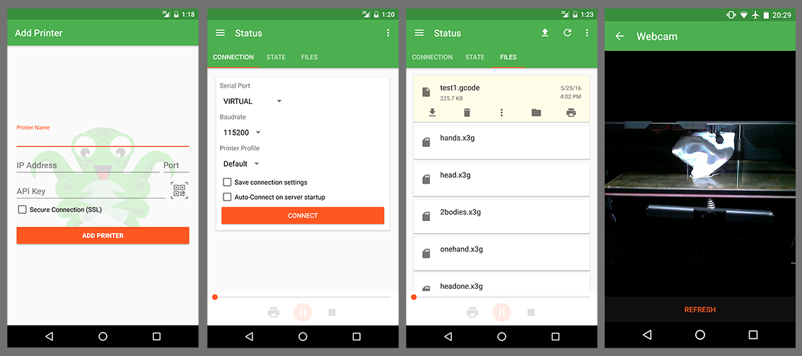

# OctoAndroid: OctoPrint for Android
Native Android interface for OctoPrint.

 

## Bugs & Feature Requests

If you find a bug please report it by using the [issues section](https://github.com/nairbspace/octoandroid/issues).

If there is some feature you think that should be implemented please do a pull request 
or report it in the [issues section](https://github.com/nairbspace/octoandroid/issues).

## Tools & Libraries

- [Dagger2](http://google.github.io/dagger/)
- [RxJava](https://github.com/ReactiveX/RxJava)
- [RxAndroid](https://github.com/ReactiveX/RxAndroid)
- [Retrofit](http://square.github.io/retrofit/)
- [JavaWebsocketClient](https://github.com/jacek-marchwicki/JavaWebsocketClient)
- [OkHttp](http://square.github.io/okhttp/)
- [Gson](https://github.com/google/gson)
- [GreenDAO](https://github.com/greenrobot/greenDAO)
- [AutoValue](https://github.com/google/auto/tree/master/value)
- [AutoValue Parcelable](https://github.com/frankiesardo/auto-parcel)
- [Google Play Services: Vision](https://developers.google.com/vision/)
- [Butterknife](http://jakewharton.github.io/butterknife/)
- [EventBus](https://github.com/greenrobot/EventBus)
- [LeakCanary](https://github.com/square/leakcanary)
- [Hugo](https://github.com/JakeWharton/hugo)
- [android-apt](https://bitbucket.org/hvisser/android-apt)
- [gradle-apt-plugin](https://github.com/tbroyer/gradle-apt-plugin)
- [Frodo](https://github.com/android10/frodo)
- [Timber](https://github.com/JakeWharton/timber)
- [MPAndroidChart](https://github.com/PhilJay/MPAndroidChart)

## Special Thanks, Credits, & Attributions

- [niqdev](https://github.com/niqdev) for his [ipcam-view](https://github.com/niqdev/ipcam-view) library
- [mariogrip](https://github.com/mariogrip) for his [OctoDroid](https://github.com/mariogrip/octodroid) app
- [Ale Estrada](https://thenounproject.com/ale-es/) for their [Octopus icon](https://thenounproject.com/search/?q=octopus&i=148061)
- [Gina Häußge](https://github.com/foosel) for [OctoPrint](http://octoprint.org/) of course
- [OctoPrint](http://octoprint.org/) for use of their [image](presentation/src/main/res/drawable/add_printer_background.png)

## License

[GNU General Public License](LICENSE)